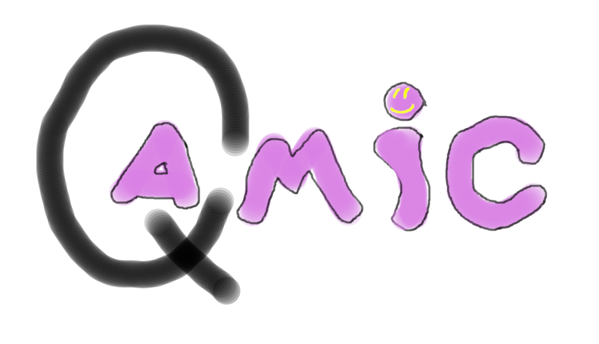

# Qamic_Compiler
Writing our own programming language as a project for my univeristy laboratory.
 
## Introduction
We are writing our own programming language for our univeristy course. For now, our lexer can interpret text file into tokens an print them out, including error handling (so if lexer cant interpret sth, info about where and what happened will be returned).

## Project structure:

- shell.py --> contains the main loop of our compiler
- basic.py --> contains lexer (scanner) with all stated tokens.
- resources/images 
- readme.md
